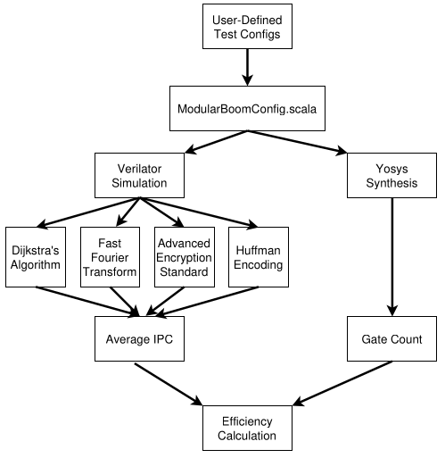
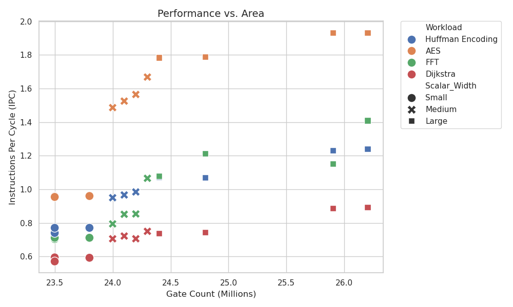
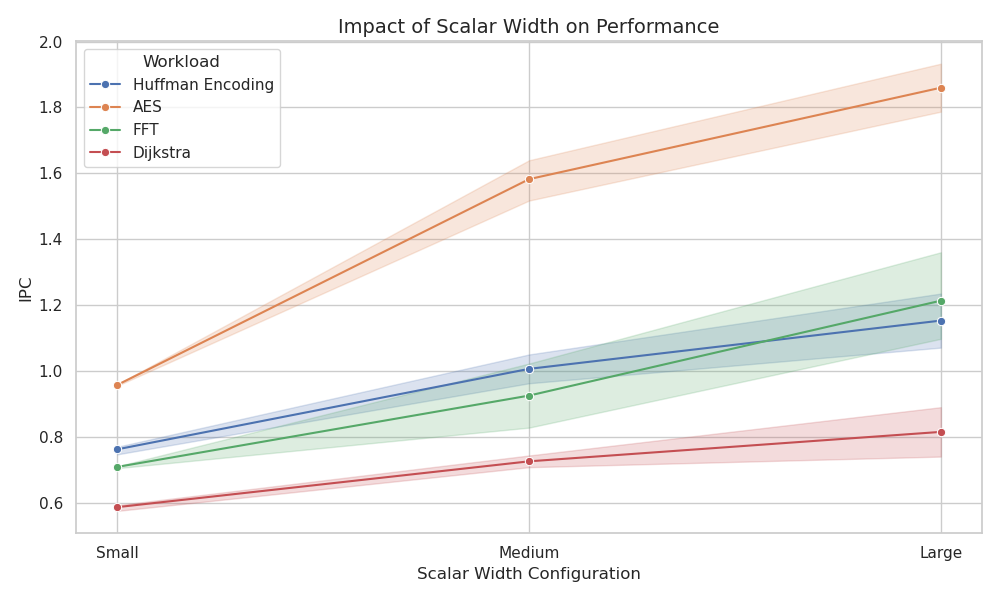

# Workload-Driven Optimization of RISC-V Core Configurations

## Summary
General-purpose processors often consume excess area and power for specific embedded applications that require only a fraction of the provided resources. This project utilizes a custom, automated design pipeline to systematically evaluate the RISC-V Berkeley Out-of-Order Machine (BOOM) core on targeted embedded workloads.

By manipulating the BOOM core's parameters on a granular level—including frontend widths, scalar widths, reorder buffer sizes, cache configurations, and branch predictors—we tested four distinct workloads: Dijkstra's Algorithm, AES Encryption, Fast Fourier Transform (FFT), and Huffman Encoding.

The key metric analyzed is Instructions per Cycle (IPC) over Gate Count, representing the performance per chip area. Our results indicate that scaling up chip size yields diminishing returns for most embedded applications, and that a smaller, workload-specific configuration offers the best performance-per-area efficiency.

## Technical Details

This repository provides an automated pipeline for Design Space Exploration (DSE) of the BOOM core within the UC Berkeley Chipyard framework.

### Architecture & Parameters
The baseline architecture is SonicBOOM (BOOMv3). We manipulate seven key parameters to evaluate trade-offs:
- **Branch Predictor:** TAGE (larger, accurate) vs. Boom2BPD
- **Cache Line Size:** 32 vs. 64 bytes
- **Cache Associativity:** 2 vs. 4 ways
- **TLB Ways:** 4 vs. 8
- **Frontend Width:** small, medium, large (fetch width, buffer size)
- **Scalar Width:** small, medium, large (decode and issue width)
- **Window Width:** small, medium, large (ROB entries, LSQ entries)

### Automated Pipeline
The pipeline evaluates user-defined configurations through four stages: parameter verification, Scala compilation, simulation in Verilator (for cycle-accurate IPC), and synthesis using Yosys (for Gate Count estimation).

*Figure: Pipeline workflow to run analysis of user-defined configurations.*

### Workloads
- **Dijkstra's Algorithm:** Tests irregular memory access and data-dependent branches.
- **AES-128:** Tests ALU throughput and cache bandwidth via bitwise processing.
- **FFT:** Tests floating-point utilization and predictable memory accesses.
- **Huffman Encoding:** Tests tree traversal and branch target buffers.

## Evaluation Results

### Performance vs Area

*Figure: Performance vs Area separated by scalar width and workload.*

There is a significant performance jump between small and medium scalar widths, but the transition to large widths yields diminishing returns for most workloads.

### Impact of Scalar Width

*Figure: Performance impact of scalar widths.*

FFT benefits the most from larger scalar widths due to instruction-level parallelism in floating-point operations and predictable memory access.

## Setup Repo
1. Pull the repo
2. Initialize chipyard as we did for previous labs
3. Run init.sh to inject custom files to chipyard environment

## Setup pipeline
1. Add new .c workload to workloads/ directory
2. Edit Makefile.md to include your new wokload
3. Run make to compile binary (make sure you are in the chipyard conda env)
4. Edit pipeline.sh with your binary name and the configs you want (options are displayed in pipeline.sh)

## Run pipeline
1. Edit pipeline.sh to use your workload
2. cd to chipyard/sims/verilator
3. Run pipeline.sh from inside that directory
4. The pipeline takes a while to run but will keep you updated

## Comments
A lot of comments provide extra detail, especially in ModularBoomConfig.scala to explain design decisions.

## Workload files
- Every workload file should include hpm_boom.h and run the respective init and and print functions
- hpm_boom.h is BOOM-specific and the hpm definitions can be found in the comments in hpm_boom.h
- I have included hpm_rocket.h and multiplication_rocket.c from lab 3 as reference.

## Future work
- I wanted to do chip size analysis using UC Berkely's Hammer tool set, but could not get it to work with only opensource materials
- I ran into mapping issues with sram, and the sram22 repo requires access to UC Berkeley servers.
- I tried using OpenRAM, but also failed to get that working.
- I think future iterations of this project could look into Power Performance Area (PPA) analysis using UC Berkeley's tools or other open source tools